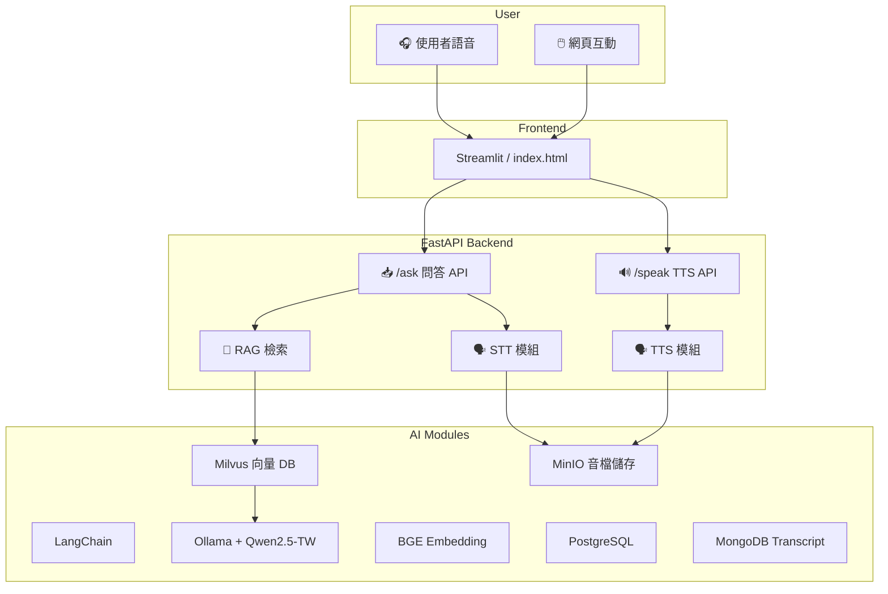

# Podwise: 模組化 Podcast 智慧推薦系統

Podwise 是一套模組化的 Podcast 智慧推薦系統，整合語音互動、語意檢索（RAG）、個人化推薦與 MLOps。具備高度可擴充性、跨模組開發能力，並部署於 Kubernetes 叢集上，支援 GPU 推論與多容器整合。

---

## 🔧 系統特色 Features

- 🎙️ 語音互動介面（Whisper STT + Breeze2 / Qwen2.5-TW TTS）
- 🔍 語意檢索（RAG）整合 LangChain + Milvus + Qwen
- 🎧 Podcast 智慧推薦（協同過濾 + 語意嵌入）
- 🧱 模組化開發設計，支援獨立維護與擴展
- ☁️ 全容器化部署於 K8s，支援 GPU 多節點推論
- 📈 支援 Prometheus + Grafana 監控，n8n 自動化，Dagster 工作排程

---

## 🧩 系統模組架構

```
frontend/
├── index.html           # Podri 聊天入口頁
└── chat/                # Streamlit 語音互動 UI

backend/
├── app.py               # FastAPI 入口
├── asr/                 # Whisper STT 模組
├── tts/                 # Breeze2 / Qwen TTS 模組
├── rag_pipeline/        # RAG 問答流程（Ollama, LangChain, Milvus）
├── ml_pipeline/         # 推薦模型訓練與推論
├── config/              # 模組初始化與參數設定
└── websocket/           # 語音串流與即時對話管理

data/
├── crawl/               # Apple/Spotify 資料爬蟲
├── storage/             # 音檔與 transcript 儲存
└── ingestion/           # PostgreSQL、MinIO、Milvus 轉存邏輯

deploy/
├── kubernetes/          # 各服務部署 YAML
├── docker-compose.yml   # 簡化測試部署
└── environments/        # dev / prod configmap
```

---

## 🚀 快速開始 Quick Start

### 1️⃣ Clone 專案

```bash
git clone https://github.com/your-org/Podwise.git
cd Podwise
```

### 2️⃣ 建立 `.env` 環境變數檔

```bash
cp .env.example .env
```

並填入：

```dotenv
POSTGRES_HOST=xxx
MINIO_ENDPOINT=xxx
MILVUS_HOST=xxx
OLLAMA_BASE_URL=http://localhost:11434
```

### 3️⃣ 啟動容器（開發用）

```bash
podman-compose up --build
```

---

## 📊 系統部署架構圖


---
##👥 組員分工 Roles & Responsibilities
| 姓名 | 工作內容 |
|------|-----------|
| 張書婷 | 系統建置、程式開發撰寫、TTS 實作開發、特徵工程、專案整合、RAG 實作評估、專案版本控管 |
| 謝理心 | RAG Prompt 設計、資料庫設計與建置、資料清整與處理、特徵工程 |
| 焦亞妗 | 前端頁面設計、TTS 實作、資料清整與處理、特徵工程 |
| 黃品茹 | RAG Prompt 設計、資料清整與處理、特徵工程 |
| 揭芷羽 | 爬蟲開發、n8n 自動化流程設計、資料清整與處理、特徵工程 |
| 藍昱昕 | 爬蟲開發、n8n 自動化流程設計、資料清整與處理、特徵工程 |

---

## 📝 授權 License

本專案使用 MIT License，詳見 [LICENSE](./LICENSE) 檔案。
