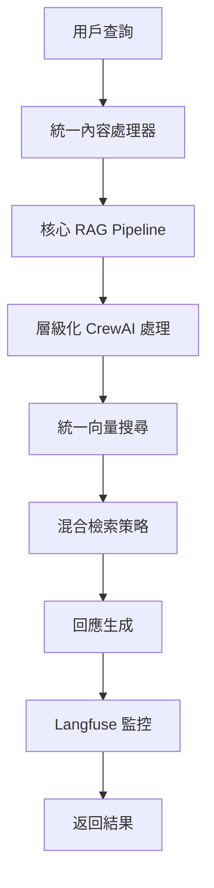

# Podwise RAG Pipeline

Podwise RAG Pipeline 是一個基於 CrewAI 架構的智能 Podcast 推薦系統，整合了語意檢索、向量搜尋和 LLM 技術。

## 🏗️ 架構設計

### 核心架構

```
rag_pipeline/
├── main.py                    # 核心 RAG Pipeline 引擎（OOP 介面）
├── app/
│   └── main_crewai.py         # FastAPI 應用程式（REST API 介面）
├── core/                      # 核心業務邏輯
│   ├── api_models.py          # 統一 API 模型定義
│   ├── content_categorizer.py # 統一內容處理器
│   ├── crew_agents.py         # CrewAI 代理架構
│   ├── hierarchical_rag_pipeline.py # 層級化 RAG Pipeline
│   └── qwen3_llm_manager.py   # Qwen3 LLM 管理器
├── config/
│   └── integrated_config.py   # 統一配置管理器
├── tools/
│   ├── enhanced_vector_search.py # 統一向量搜尋工具
│   ├── podcast_formatter.py   # Podcast 格式化工具
│   └── web_search_tool.py     # Web 搜尋工具
├── utils/                     # 工具函數
├── monitoring/                # 監控模組
├── scripts/                   # 腳本工具
└── examples/                  # 使用範例
```

### 職責分離

#### `main.py` - 核心引擎
- **目的**: 提供統一的 OOP 介面
- **功能**: 
  - 層級化 CrewAI 架構
  - 語意檢索（text2vec-base-chinese + TAG_info.csv）
  - 提示詞模板系統
  - Langfuse 監控
  - 健康檢查
- **使用場景**: 程式化調用、整合到其他系統

#### `app/main_crewai.py` - Web API 介面
- **目的**: 提供 REST API 介面
- **功能**:
  - 用戶查詢處理和分類
  - Podcast 推薦系統
  - 用戶 ID 驗證
  - 統一向量搜尋整合
  - REST API 端點
- **使用場景**: Web 應用程式、前端整合

## 🚀 快速開始

### 1. 環境準備

```bash
# 安裝依賴
pip install -r requirements.txt

# 設定環境變數
export LANGFUSE_SECRET_KEY="your_langfuse_secret"
export LANGFUSE_PUBLIC_KEY="your_langfuse_public"
export LANGFUSE_HOST="https://cloud.langfuse.com"
```

### 2. 使用核心引擎

```python
from main import PodwiseRAGPipeline

# 創建 RAG Pipeline 實例
pipeline = PodwiseRAGPipeline(
    enable_monitoring=True,
    enable_semantic_retrieval=True,
    confidence_threshold=0.7
)

# 處理查詢
response = await pipeline.process_query(
    query="我想學習投資理財，有什麼推薦的 Podcast 嗎？",
    user_id="user123"
)

print(f"回應: {response.content}")
print(f"信心度: {response.confidence}")
print(f"來源: {len(response.sources)} 個")
```

### 3. 啟動 Web API

```bash
# 啟動 FastAPI 應用
cd app
python main_crewai.py

# 或使用 uvicorn
uvicorn main_crewai:app --host 0.0.0.0 --port 8000
```

### 4. API 使用範例

```bash
# 健康檢查
curl http://localhost:8000/health

# 處理查詢
curl -X POST "http://localhost:8000/api/v1/query" \
  -H "Content-Type: application/json" \
  -d '{
    "user_id": "user123",
    "query": "我想學習投資理財，有什麼推薦的 Podcast 嗎？"
  }'

# 驗證用戶
curl -X POST "http://localhost:8000/api/v1/validate-user" \
  -H "Content-Type: application/json" \
  -d '{"user_id": "user123"}'
```

## 🔧 核心功能

### 三層 CrewAI 架構

1. **領導者代理 (LeaderAgent)**
   - 協調所有專家代理
   - 決策最終回應
   - 管理處理流程

2. **商業專家 (BusinessExpertAgent)**
   - 處理商業相關查詢
   - 提供投資理財建議
   - 分析市場趨勢

3. **教育專家 (EducationExpertAgent)**
   - 處理教育相關查詢
   - 提供學習建議
   - 職涯發展指導

### 統一向量搜尋

- **Milvus 向量搜尋**: 高效向量資料庫搜尋
- **KNN 推薦算法**: 基於相似度的推薦
- **智能標籤提取**: 自動標籤匹配和映射
- **混合檢索策略**: 結合多種搜尋方法

### 統一內容處理

- **內容分類**: 自動分類為商業/教育/其他
- **關鍵詞提取**: 智能關鍵詞識別
- **內容摘要**: 根據分類生成摘要
- **標籤管理**: 統一標籤系統

### 統一配置管理

- **模型配置**: LLM、向量、嵌入模型設定
- **資料庫配置**: MongoDB、PostgreSQL、Redis、Milvus
- **API 配置**: OpenAI、Anthropic、Google、Supabase
- **CrewAI 配置**: 代理參數和行為設定
- **RAG 配置**: 檢索和生成參數
- **語意檢索配置**: 標籤匹配和相似度計算

### Langfuse 監控整合

- **LLM 思考過程追蹤**: 記錄模型推理過程
- **模型選擇追蹤**: 監控模型選擇決策
- **代理互動追蹤**: 追蹤代理間協作
- **語意檢索追蹤**: 監控檢索效果
- **效能指標**: 處理時間、信心度等

## 📊 系統流程



## 🛠️ 配置說明

### 統一配置管理

```python
from config.integrated_config import get_config

config = get_config()

# 獲取各模組配置
llm_config = config.get_llm_config()
vector_config = config.get_vector_search_config()
crewai_config = config.get_crewai_config()
semantic_config = config.get_semantic_config()
rag_config = config.get_rag_config()
langfuse_config = config.get_langfuse_config()
```

### 環境變數配置

```bash
# API 金鑰
OPENAI_API_KEY=your_openai_key
ANTHROPIC_API_KEY=your_anthropic_key
GOOGLE_API_KEY=your_google_key

# 資料庫配置
MONGODB_URI=mongodb://localhost:27017/podwise
POSTGRES_PASSWORD=your_postgres_password
REDIS_PASSWORD=your_redis_password

# Langfuse 配置
LANGFUSE_PUBLIC_KEY=your_langfuse_public
LANGFUSE_SECRET_KEY=your_langfuse_secret
LANGFUSE_HOST=https://cloud.langfuse.com
```

## 📈 監控與分析

### Langfuse 儀表板

訪問 Langfuse 儀表板查看：
- 查詢處理效能
- 模型回應品質
- 代理協作效果
- 系統健康狀態

### 效能指標

- **處理時間**: 查詢到回應的時間
- **信心度**: 系統對回應的信心水平
- **檢索準確率**: 語意檢索的相關性
- **用戶滿意度**: 基於互動的滿意度評分

## 🔍 開發指南

### 添加新的專家代理

1. 在 `core/crew_agents.py` 中創建新的代理類別
2. 實現 `process()` 方法
3. 在 `main.py` 中註冊代理
4. 更新配置檔案

### 擴展向量搜尋

1. 在 `tools/enhanced_vector_search.py` 中添加新的搜尋方法
2. 實現 `BaseVectorSearch` 抽象類別
3. 在 `UnifiedVectorSearch` 中整合新方法
4. 測試搜尋效果

### 自定義內容處理

1. 在 `core/content_categorizer.py` 中添加新的處理邏輯
2. 擴展關鍵詞提供者
3. 實現新的分類規則
4. 驗證處理效果

## 🚀 部署指南

### Docker 部署

```bash
# 構建映像
docker build -t podwise-rag-pipeline .

# 運行容器
docker run -p 8000:8000 podwise-rag-pipeline
```

### Kubernetes 部署

```bash
# 部署到 Kubernetes
kubectl apply -f deploy/k8s/rag-pipeline/

# 檢查部署狀態
kubectl get pods -n podwise
```

## 📝 更新日誌

### v3.0.0 (2025-01-15)
- ✅ 重構架構，分離核心引擎和 Web API
- ✅ 整合統一配置管理器
- ✅ 統一向量搜尋工具
- ✅ 統一內容處理器
- ✅ 統一 API 模型定義
- ✅ 移除重複功能，確保架構整潔
- ✅ 優化 CrewAI 代理協作
- ✅ 增強語意檢索功能
- ✅ 改進錯誤處理和日誌記錄

### v2.0.0 (2025-01-10)
- ✅ 實現三層 CrewAI 架構
- ✅ 整合向量搜尋
- ✅ 添加 KNN 推薦算法
- ✅ 實現用戶 ID 管理

### v1.0.0 (2025-01-05)
- ✅ 基礎 RAG Pipeline 實現
- ✅ 語意檢索功能
- ✅ 基本 API 端點

## 🤝 貢獻指南

1. Fork 專案
2. 創建功能分支
3. 提交變更
4. 發起 Pull Request

## 📄 授權

本專案採用 MIT 授權條款。

## 📞 支援

如有問題或建議，請：
- 提交 Issue
- 發送郵件至 support@podwise.com
- 查看文檔：https://docs.podwise.com 